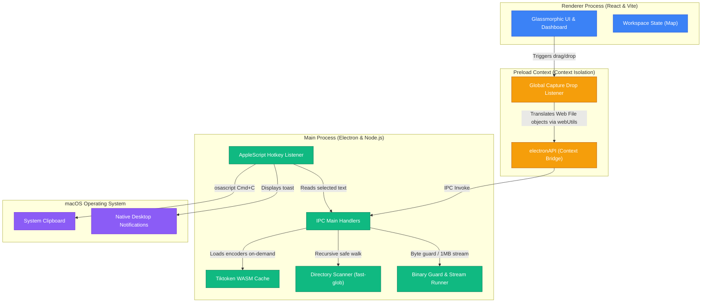

# 🖥️ Token Calculator

An ultra-premium, 100% local, high-performance **Token Calculator** desktop application built on **Electron**, **React**, and **TypeScript**. Powered by **Vite** and styled with modern glassmorphism, this tool lets developers, AI engineers, and prompt designers measure token loads, analyze file sizes, and tokenize directories instantly—completely offline with absolute privacy.

---

## ✨ Key Features & Capabilities

*   **📂 Multi-File & Folder Scanning**: Drag and drop complex directory structures or single files directly into the workspace. Supports a native system picker dialog for mixed multi-path selection.
*   **⚡ Local & Private Tokenization**: Leverages high-performance WebAssembly (`tiktoken`) for offline counting. Zero network requests, keeping your proprietary code bases and documents 100% secure.
*   **🖼️ Native Image Vision Tokenizer**: Integrates the official **OpenAI Vision Pricing Formula** to calculate tile-based tokens for images (`.png`, `.jpeg`, `.webp`, `.gif`), dynamically fitting within a 2048x2048 grid and scaling to a 768px short edge.
*   **🌊 Non-Blocking Large File Stream**: Effortlessly parses massive files (up to and beyond 10MB+) by streaming in 1MB chunks and yielding control to the Electron main event loop via `setImmediate`, keeping the UI 100% fluid and responsive.
*   **🛡️ Zero-Dependency Binary File Guard**: Scans unknown file extensions by reading the first 1KB of bytes to inspect for null bytes (`\0`). Skips binary payloads (e.g. zip, pdf, exe) automatically to prevent memory choking and CPU lock.
*   **🧠 Memoized WASM Cache**: Implements $O(1)$ memory-cached retrieval of Tiktoken WASM encoder instances, enabling instant hot-switching between tokenizer models (`o200k_base`, `cl100k_base`, etc.) without heap fragmentation or leakage.
*   **🎙️ Global System Hotkey (macOS)**: Press `Cmd + Option + T` from **any external application** to grab the currently highlighted text, compute its token count, and push a native macOS desktop notification—restoring your clipboard immediately afterward.
*   **🎨 Premium Glassmorphic UI**: Gorgeous dark-mode dashboard featuring unified drag-and-drop overlays, sequential workspace appending, search/filters, dynamic slide-in listings with cascade delays, and relative path formatting (e.g., mapping user home to `~`).

---

## 🏛️ System Architecture

The application is architected around Electron's security boundaries, utilizing a decoupled architecture: **Main Process (Node.js)** for heavy local file system interactions, **Preload Script** for secure API exposures, and **Renderer Process (React/Vite)** for rendering the modern interface.



---

## ⚙️ Technical Deep-Dive & Optimizations

### 1. High-Performance Parallelization (`pLimit`)
Rather than choking the thread pool or launching massive numbers of unresolved file-read promises simultaneously, the application utilizes a custom-engineered concurrency-limiting batch runner (`pLimit`). It limits parallel disk read operations to batches of:
*   **15 items** for recursive directory scans
*   **5 items** for high-level bulk path calculations

### 2. Memoized WASM Tiktoken Cache
Repeatedly re-initializing WebAssembly Tiktoken encoder engines triggers expensive garbage-collection routines and slows calculations. We solve this by caching loaded encoders:
```typescript
const encoders: Record<string, Tiktoken> = {};

function getEncoder(encodingName: TiktokenEncoding): Tiktoken {
  if (!encoders[encodingName]) {
    encoders[encodingName] = get_encoding(encodingName);
  }
  return encoders[encodingName];
}
```
This guarantees sub-millisecond calculation updates during hot-switching.

### 3. Non-Blocking Event-Loop Yielding
For files exceeding **10MB**, loading them completely into a single string triggers memory spikes. The Token Calculator handles this by chunking via standard Node.js readable streams and yielding execution to the event loop so that the Electron UI remains highly fluid:
```typescript
stream.on('data', async (chunk: string) => {
  stream.pause();
  tokenCount += calculateTokensForText(chunk, encoding);
  // Yield control to the event loop
  await new Promise(resolveYield => setImmediate(resolveYield));
  stream.resume();
});
```

---

## 🚀 Getting Started

### Prerequisites

*   [Node.js](https://nodejs.org/) (v18.0.0 or higher recommended)
*   [npm](https://www.npmjs.com/) (installed automatically with Node.js)
*   **macOS** (Optional: required for the AppleScript-based Global Hotkey feature)

### Installation

1. Clone the repository:
   ```bash
   git clone https://github.com/SuhaasNandeesh/token-calculator.git
   cd token-calculator
   ```

2. Install all development and runtime dependencies:
   ```bash
   npm install
   ```

### Running the Application

Start the Vite development server and launch the Electron application concurrently:
```bash
npm run dev
```

### Building & Packaging

To compile the TypeScript source files, build the Vite bundles, and pack the desktop application for distribution:
```bash
# Compiles React components and Electron files
npm run build

# Packages application for deployment (uses electron-builder)
npx electron-builder
```

---

## 🛠️ Developer Reference

### IPC Channel Interface

The renderer process interacts with Node.js capabilities through secure, bridge-isolated channels:

| IPC Channel | Invocation | Payload | Returns | Description |
| :--- | :--- | :--- | :--- | :--- |
| `calculate-text-tokens` | `invoke` | `(text, encoding)` | `number` | Calculates token count for raw strings. |
| `calculate-path-tokens` | `invoke` | `(path, encoding)` | `{ totalTokens, breakdown }` | Walks a directory or file and counts tokens. |
| `calculate-paths-tokens-bulk` | `invoke` | `(paths[], encoding)`| `{ totalTokens, breakdown }` | Performs concurrent batch token counts. |
| `select-paths` | `invoke` | *None* | `string[]` | Displays the native system file/directory picker. |

### Default Exclusion Patterns

The recursive path scanner automatically ignores:
*   Folders: `node_modules`, `.git`, `dist`, `build`, `.next`, `venv`, `.venv`, `env`
*   Extensions: `.exe`, `.dll`, `.so`, `.dylib`, `.bin`, `.zip`, `.tar`, `.gz`, `.7z`, `.rar`, `.pdf`, `.mp4`, `.mp3`, `.wav`, `.webm`

---

## 📝 Critical Learnings & Structural Configurations

These design patterns and constraints must be strictly adhered to:
1.  **TypeScript CommonJS Bundles for Electron**: We maintain standard CommonJS outputs for the main/preload scripts of Electron. Do not configure `"type": "module"` in `package.json` to prevent runtime loader issues in Node; instead, we use `vite.config.mts` to handle transpilation.
2.  **JSDOM Testing Safeguards**: JSDOM environments cannot simulate native browser drop coordinates and `DataTransfer` mechanics perfectly. Focus unit tests for the core calculation layer in `electron/tokenLogic.test.ts` and test UI states (hover flags, list updates) using React Testing Library in `src/App.test.tsx`.

---

## 📄 License

This project is licensed under the MIT License. See the [LICENSE](LICENSE) file for more details.
