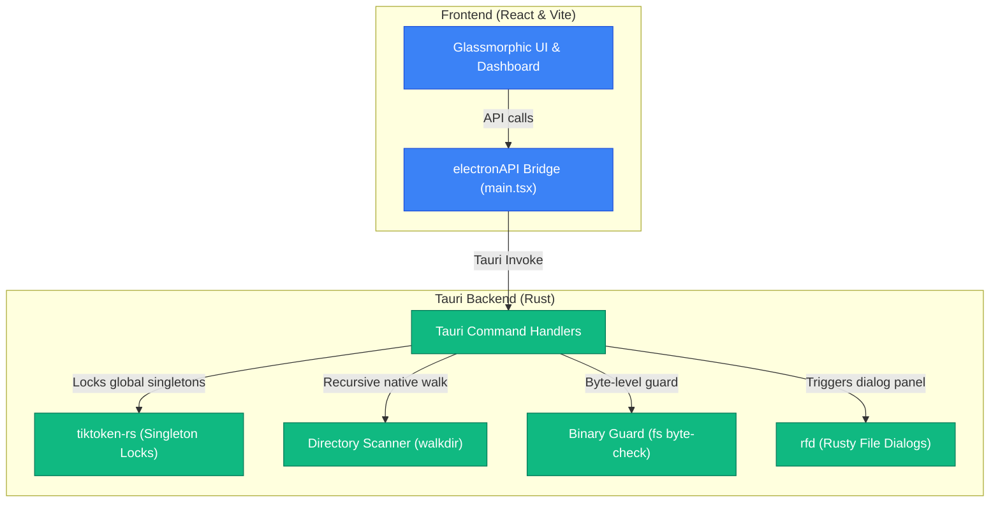

# 🖥️ Token Calculator (Tauri v2 + Rust)

An ultra-premium, 100% local, high-performance **Token Calculator** desktop application rebuilt on **Tauri v2**, **React**, and **TypeScript**. Powered by a lightning-fast native **Rust** backend, this tool lets developers, AI engineers, and prompt designers measure token loads, analyze file sizes, and tokenize directories instantly—completely offline with absolute privacy and a tiny installation size of **just 4.8 MB** (a 96% reduction from Electron!).

---

## 💡 macOS Gatekeeper Troubleshooting ("App is Damaged")

> [!IMPORTANT]
> Because this local app is ad-hoc signed (free developer build) and downloaded from the web, macOS's Gatekeeper security mechanism will tag it with a quarantine attribute and show a misleading **"Token Calculator is damaged and can't be opened"** warning. 
> 
> **To unlock it in 5 seconds, simply remove the quarantine attribute via your Terminal:**
> ```bash
> xattr -cr /Applications/Token\ Calculator.app
> ```
> *(Or if running directly from your Downloads folder: `xattr -cr ~/Downloads/Token\ Calculator.app`)*

---

## ✨ Key Features & Capabilities

*   **⚡ Native Rust Tokenizer**: Leverages high-performance native Rust singletons of `tiktoken-rs` (`o200k_base_singleton().lock().encode(...)`) for offline counting. Zero network requests, keeping your proprietary code bases and documents 100% secure.
*   **📂 Multi-File & Folder Scanning**: Drag and drop complex directory structures or single files directly into the workspace. Powered by a multi-threaded recursive directory walker (`walkdir`) in Rust.
*   **🖼️ Native Image Vision Tokenizer**: Integrates the official **OpenAI Vision Pricing Formula** to calculate tile-based tokens for images (`.png`, `.jpeg`, `.webp`, `.gif`), dynamically fitting within a 2048x2048 grid and scaling to a 768px short edge.
*   **🛡️ Zero-Dependency Binary File Guard**: Scans unknown file extensions by reading the first 1KB of bytes to inspect for null bytes (`\0`). Skips binary payloads (e.g. zip, pdf, exe) automatically to prevent memory choking.
*   **🎨 Premium Glassmorphic UI**: Gorgeous dark-mode dashboard featuring unified drag-and-drop overlays, sequential workspace appending, search/filters, dynamic slide-in listings with cascade delays, and relative path formatting (e.g., mapping user home to `~`).

---

## 🏛️ System Architecture

The application is architected around Tauri's secure boundaries: a modern, reactive frontend (React/Vite) bridged to an ultra-fast backend (compiled Rust binary) via secure system commands.



---

## ⚙️ Build Optimization Profiling

To achieve the ultra-small footprint (~4.8 MB installer), the Rust compiler is configured with maximum optimization profiles in `src-tauri/Cargo.toml`:
*   **Link-Time Optimization (`lto = true`)**: Performs deep across-crate optimizations to remove unused code.
*   **Single Codegen Unit (`codegen-units = 1`)**: Sacrifices compilation time for maximum size reductions.
*   **Symbol Stripping (`strip = true`)**: Automatically removes all debug symbols and tables from the compiled binary.
*   **Size Minimizer (`opt-level = "z"`)**: Explicitly instructs `rustc` to prioritize code size above all else.

---

## 🚀 Getting Started

### Prerequisites

*   **Node.js** (v18 or higher)
*   **Rust Compiler** (installed automatically via `brew install rust` or `rustup`)

### Development Mode

1. Install dependencies:
   ```bash
   npm install
   ```

2. Run the application locally in development mode:
   ```bash
   npm run dev
   ```

### Building & Packaging

To compile the React frontend, optimize the Rust backend, and bundle the final `.dmg` desktop installer:
```bash
npm run tauri build
```
*(The generated `.dmg` will be saved in `src-tauri/target/release/bundle/dmg/`)*

---

## 🛠️ Developer Reference

### Tauri Command Interface

The frontend interacts with the Rust backend through the following registered Tauri commands:

| Command | Payload | Returns | Description |
| :--- | :--- | :--- | :--- |
| `calculate_text_tokens` | `(text, encoding)` | `number` | Calculates token count for raw strings using mutex locks. |
| `calculate_path_tokens` | `(target_path, encoding)` | `number` | Walks a single file or directory recursively in Rust and counts tokens. |
| `calculate_paths_tokens_bulk` | `(target_paths[], encoding)`| `{ totalTokens, breakdown }` | Evaluates multiple paths concurrently. |
| `select_paths` | *None* | `string[]` | Displays the native system file picker using the `rfd` crate. |
| `select_folders` | *None* | `string[]` | Displays the native system folder picker using the `rfd` crate. |

---

## 📄 License

This project is licensed under the MIT License. See the [LICENSE](LICENSE) file for more details.
